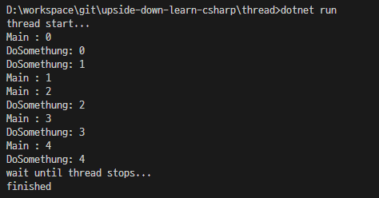
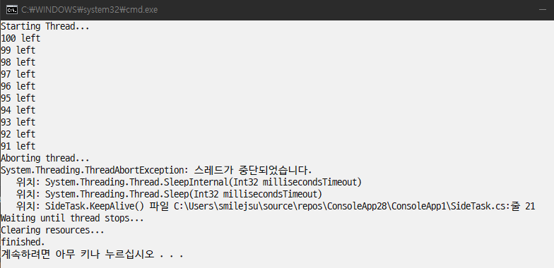
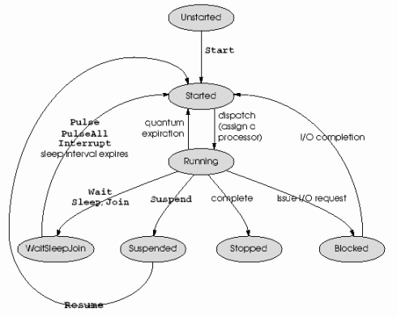
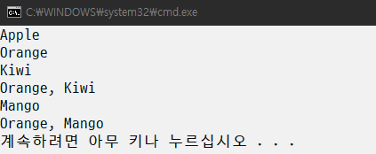

# upside-down-learn-csharp (거꾸로 배우는 C#)

> 그동안 책을 펴고 1장부터 공부 하셨다면 이제는 거꾸로 마지막장부터 공부할 차례입니다.

## 30. Process & Thread

Process : 실행파일이 실행되어 메모리에 적재된 인스턴스  
Thread : 프로세스내에서 실행되는 흐름의 단위를 말한다

각 프로세스는 주 스레드라고 하는 단일 스레드로 시작한다.  
모든 스레드에서 추가 스레드를 만들수 있다  
프로세스 내의 모든 스레드는 해당 프로세스의 주소 공간을 공유 한다

1시간짜리 영화를 비디오플레이어를 통해 재생했다  
단일 쓰레드로 만들었다면 프로세스를 중지 하기 전까지 재생되는 영화를 정지할수 없을것이다  
사용자 입력에 대한 쓰레드를 추가 한다면 영화를 보면서 사용자 입력을 받을수 있을것이다

프로세스끼리 데이터를 교환 하려면 소켓이나 공유메모리(Inter Process Communication)를 이용해야 한다  
프로세스 간 통신(Inter-Process Communication, IPC)이란 프로세스들 사이에 서로 데이터를 주고받는 행위 또는 그에 대한 방법이나 경로를 뜻한다.

간단한 IPC 통신 예제를 살펴 본다

```C#
using System;
using System.IO;
using System.IO.Pipes;

namespace ipc_server
{
    class Program
    {
        static void Main(string[] args)
        {
            Console.WriteLine("press any key to connect server");
            Console.ReadKey();
            string message = null;
            Console.WriteLine("wait for connection...");
            using (NamedPipeServerStream stream = new NamedPipeServerStream("testpipe", PipeDirection.In))
            {
                stream.WaitForConnection();
                StreamReader reader = new StreamReader(stream);
                message = reader.ReadToEnd();
            }
            Console.WriteLine("message recived : " + message);
        }
    }
}
```

```C#
using System;
using System.IO;
using System.IO.Pipes;

namespace ipc_client
{
    class Program
    {
        static void Main(string[] args)
        {
            Console.WriteLine("press any key to start server");
            Console.ReadKey();

            using (NamedPipeClientStream stream = new NamedPipeClientStream(".", "testpipe", PipeDirection.Out, PipeOptions.None))
            {
                Console.WriteLine(stream);
                if (!stream.IsConnected)
                {
                    stream.Connect(1000);
                    Console.WriteLine("server connected!");
                }
                StreamWriter writer = new StreamWriter(stream);

                writer.WriteLine("Hello World!");
                writer.Flush();
            }
        }
    }
}

```

1. Thread 인스턴스 생성 (매개변수로 쓰레드가 실행할 메서드)
2. Thread.Start() 메서드 호출
3. Thread.Join() 메서드 호출 하여 쓰레드가 끝날때까지 대기

https://docs.microsoft.com/ko-kr/dotnet/api/system.threading.thread?view=net-5.0

```C#
using System;
using System.Threading;

namespace thread
{
    class Program
    {
        static void Main(string[] args)
        {
            Thread t1 = new Thread(new ThreadStart(SayHello));
            t1.Start();
            t1.Join();
        }

        static void SayHello()
        {
            Console.WriteLine("Hello World!");
        }
    }
}
```

실제 쓰레드가 메모리에 적재 되는 시점은 t1.Start() 메서드를 호출 하는 시점이다
Thread 클래스의 인스턴스는 준비만 해둘뿐이다  
t1.Start() 메서드가 호출되고 나면 CRL은 쓰레드를 실제로 생성하여 SayHello 메서드를 호출 한다  
t1.Join() 메서드는 블록되어 있다가 SayHello()메서드의 실행이 끝나면 (t1쓰레드의 실행이 끝나면) 반환되어 다음 코드를 실행 할수 있게 한다

t1쓰레드가 실행되어 메인 쓰레드에서 분리 된다  
Join()메서드를 실행하여 쓰레드가 완전히 정지 할대까지 대기 한다  
Join()메서드가 반환되고 나면 프로그램의 흐름은 다시 메인 쓰레드로 합쳐진다

```C#
using System;
using System.Threading;

namespace thread
{
    class Program
    {
        static void Main(string[] args)
        {
            Thread t1 = new Thread(new ThreadStart(Program.DoSomething));

            Console.WriteLine("thread start...");

            t1.Start();

            for (int i = 0; i < 5; i++)
            {
                Console.WriteLine("Main : {0}", i);
                Thread.Sleep(10);
            }

            Console.WriteLine("wait until thread stops...");

            t1.Join();

            Console.WriteLine("finished");

        }

        static void DoSomething()
        {
            for (int i = 0; i < 5; i++)
            {
                Console.WriteLine("DoSomethung: {0}", i);
                Thread.Sleep(10);
            }
        }
    }
}
```

</img>

쓰레드 임의 종료 시키기

프로세스는 사용자가 작업 관리자 등을 이용해 임의로 종료 시킬수 있다  
프로세스안에서 동작하는 각 쓰레드는 작업관리자에서 종료 할수 없다  
쓰레드를 종료 시키기 위해서는 음과 같이 Abort()메서드를 호출 해야 한다

```C#
using System;
using System.Threading;

namespace thread
{
    class Program
    {
        static void Main(string[] args)
        {
            Thread t1 = new Thread(new ThreadStart(Program.DoSomething));
            t1.Start();
            t1.Abort(); //Thread 종료
            t1.Join();
        }

        static void DoSomething()
        {
            try
            {
                for (int i = 0; i < 5; i++)
                {
                    Console.WriteLine("DoSomething: {0}", i);
                }
            }
            catch (ThreadAbortException e)
            {

            }
            finally
            {

            }


        }
    }
}
```

Abort()메서드를 호출 한다고 즉시 쓰레드가 종료 되지 않는다는것이다
Abort()메서드를 호출하면 CLR은 해당 스레드가 실행중이던 코드에 ThreadAbortException을 호출 한다

다음을 참고 한다  
https://docs.microsoft.com/ko-kr/dotnet/standard/threading/pausing-and-resuming-threads
https://docs.microsoft.com/ko-kr/dotnet/api/system.threading.threadabortexception?view=net-5.0

> Thread.Abort는 대기 상태에서 스레드를 깨우고 스레드에서 ThreadAbortException을 throw합니다. 자세한 내용은 스레드 제거를 참조하세요.
> 이 예외를 catch하는 코드가 있으면 예외를 처리한다음 finally 블록까지 실행한후에 해당 쓰레드는 완전히 종료 된다

t1.Start() : t1쓰레드가 실행되어 메인쓰레드에서 분기 된다.  
t1.Abort() : Abort()메서드를 실행하여 쓰레드 정지를 시도 한다.  
t1.Join() : Join()메서드를 실행하여 쓰레드가 완전히 정지 할대까지 대기 한다.  
Join()메서드가 반환대고 나면 프로그램의 흐름은 다시 메인 쓰레드 하나로 합쳐진다.

_Thread.Abort() 메서드는 사용하지 않는것이 좋다._

예를들어 한 쓰레드가 독점한 자원에서 그 자원을 해제 하지 못하고 Abort()메서드에 의해 정지를 시도 한다면 다른 쓰레드들은 그 자원을 사용할수 없게 된다.
대안은 해당 쓰레드의 기능을 계속 수행 할것인지에 대한 상태를 다른 쓰레드들과 공유 하고 그 상태를 외부 쓰레드에서 관리 하도록 한다.

```C#
using System;
using System.Threading;

public class SideTask
{
    int count;

    //constructor
    public SideTask(int count)
    {
        this.count = count;
    }

    public void KeepAlive()
    {
        try
        {
            while (count > 0)
            {
                Console.WriteLine("{0} left", count--);
                Thread.Sleep(10);
            }
            Console.WriteLine("count: {0}", 0);
        }
        catch (ThreadAbortException e)
        {
            Console.WriteLine(e);
            Thread.ResetAbort();
        }
        finally
        {
            Console.WriteLine("Clearing resources...");
        }
    }
}
```

```C#
using System;
using System.Threading;

namespace thread
{
    class Program
    {
        static void Main(string[] args)
        {
            SideTask task = new SideTask(100);
            Thread t1 = new Thread(new ThreadStart(task.KeepAlive));
            t1.IsBackground = false;

            Console.WriteLine("Starting Thread...");
            t1.Start();

            Thread.Sleep(100);

            Console.WriteLine("Aborting thread...");
            t1.Abort();

            Console.WriteLine("Waiting until thread stops...");
            t1.Join();

            Console.WriteLine("finished.");
        }
    }
}

```

</img><br>

## Thread의 생명주기

| 상태          | 설명                                                                                                                                                                                                                                                                                                                                                      |
| ------------- | --------------------------------------------------------------------------------------------------------------------------------------------------------------------------------------------------------------------------------------------------------------------------------------------------------------------------------------------------------- |
| Unstarted     | 쓰레드 객체를 생성한후 Thread.Start()메서드가 호출되기 전 상태                                                                                                                                                                                                                                                                                            |
| Running       | 쓰레드가 시작하여 동작중인 상태<br> Unstarted상태의 쓰레드를 Thread.Start()메서드를 통해 이 상태로 만들수 있음                                                                                                                                                                                                                                            |
| Suspended     | 쓰레드의 일시 중단 상태<br>쓰레드를 Thread.Suspended()메서드를통해 이상태로 만들수 있음<br> Suspended상태인 쓰레드는 Thread.Resume()메서드를 통해 다시 Running상태로 만들수 있음                                                                                                                                                                          |
| WaitSleepJoin | 쓰레드가 블록(Block)된 상태<br>Monitor.Enter(), Thread.Sleep(), Thread.Join()메서드를 호출하면 이상태가 됨                                                                                                                                                                                                                                                |
| Aborted       | 쓰레드가 취소된 상태<br>Aborted된 쓰레드는 다시 Stopped상태로 전환되어 완전히 중지 한다.                                                                                                                                                                                                                                                                  |
| Stopped       | 중지된 쓰레드의 상태<br>Abort()메서드를 호출하거나 쓰레드가 실행중인 메서드가 종료 되면 이상태가 됨                                                                                                                                                                                                                                                       |
| Background    | 쓰레드가 백그라운드로 동작하고 있음을 나타냄<br>Foreground쓰레드는 하나라도 살아있는 한 프로세스는 죽지 않지만 백그라운드는 하나가 아니라 열개가 살아있어도 프로세스가 죽고 사는데는 영향을 미치지 않음<br>하지만 프로세스가 죽으면 백그라운드 쓰레드들도 모두 죽는다<br>Thread.IsBackground속성에 true값을 입력 함으로써 쓰레드를 이 상태로 만들수 있음. |

참고: https://docs.microsoft.com/en-us/dotnet/api/system.threading.threadstate?redirectedfrom=MSDN&view=net-5.0

</img>

Aborted상태의 쓰레드는 Running상태로 전이 되지 못한다.  
Running상태의 쓰레드는 Unstarted상태로 바뀔수 없다.  
Background상태로 전이 하는 과정이 없는 이유는 쓰레드의 동작일뿐이기 때문이다 (다른 쓰레드는 어떠한 상황)

ThreadState열거형 맴버에 대해 알야아 한다
Flags 속성을 가지고 있다 Flags는 자신이 수식하는 열거형 비트필드 (플래그 집합)으로 처리 할수 있음을 나타낸다

> 비트필드는 C언어등에서 구조체를 선언할때 바이트 단위가 아닌 비트 단위로 선언한 필드를 말한다<br>
> 메모리 가격과 용량을 생각해 당시 (1970년 C언어가 만들어졌을 시기) 충분한 이유일수 있다<br>
> 2002년에 개발된 C#언어는 메모리나 프로세스 용량이 풍부해진 시대에 태어났지만 우수 비트 필드 사용사례를 이용할수 있게 속성으로 존재 하는것이다.<br>

https://docs.microsoft.com/ko-kr/dotnet/api/system.flagsattribute?view=net-5.0

```C#
using System;
using System.Threading;

namespace thread
{
    class Program
    {
        [Flags]
        public enum MyEnum
        {
            Apple = 0,
            Orange = 1,
            Kiwi = 2,
            Mango = 4
        }

        static void Main(string[] args)
        {
            Console.WriteLine((MyEnum)0);
            Console.WriteLine((MyEnum)1);
            Console.WriteLine((MyEnum)2);
            Console.WriteLine((MyEnum)3);
            Console.WriteLine((MyEnum)4);
            Console.WriteLine((MyEnum)5);
        }
    }
}
```

</img>

쓰레드는 동시에 두가지 상태를 가질수 있다  
Suspended이면서 WaitSleepJoin상태를 가질수 있으며 Background상태이면서 Stopped상태일수 있다  
그래서 ThreadState는 두가지 이상의 상태를 동시에 표현하기 위해 Flags속성이 수식되어 있는것이다
